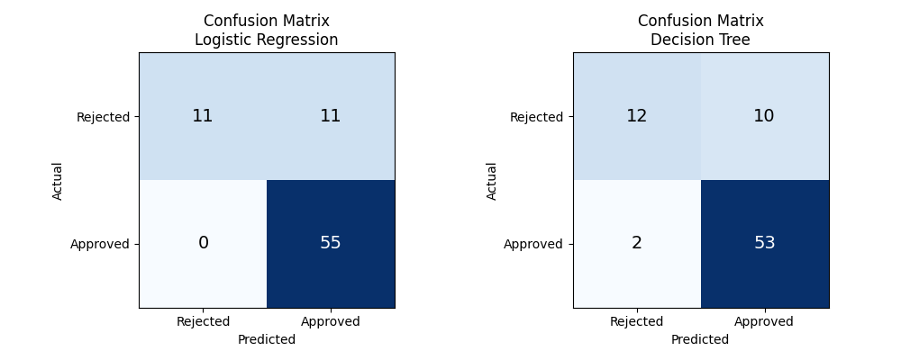
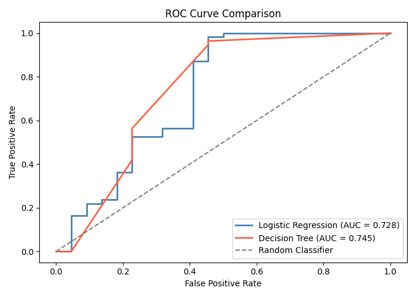
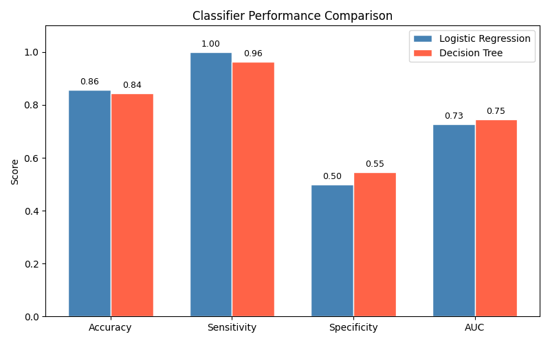

# Loan Status Classification
## Technical Report — Data Mining Assignment
### Grand Canyon University
#### Ortasele Aisuan

---

## Problem Statement

Banks and financial institutions face significant risk when approving loans for applicants who are likely to default. Manually reviewing each application is time-consuming and inconsistent. This project builds and compares two machine learning classifiers, Logistic Regression and Decision Tree, that predict whether a loan application should be approved or rejected based on applicant characteristics. The goal is to identify which classifier performs better and what the results reveal about the dataset.

---

## Part 1: Data Mining Techniques

### Classification

Classification is a supervised machine learning technique where an algorithm learns to assign input data into predefined categories based on labeled training examples. The algorithm identifies patterns in historical data where the correct answer is already known and uses those patterns to predict the category of new unseen data. Classification is most useful when the output is a discrete label such as approved or rejected, spam or not spam, or good or bad.

**Strengths:** Fast predictions on new data once trained, works well on large datasets, and produces interpretable results especially with models like decision trees.

**Weaknesses:** Requires a large amount of labeled training data, sensitive to class imbalance, and can underperform when the decision boundary between classes is not clear.

**Real-world example:** Credit card fraud detection. Banks train classifiers on millions of historical transactions labeled as fraudulent or legitimate. When a new transaction occurs the classifier instantly predicts whether it is fraud based on patterns like transaction amount, location, and time of day (Raschka, Liu, & Mirjalili, 2022).

### Prediction

Prediction is a supervised technique where the model estimates a continuous numerical value rather than a category. Instead of classifying something as approved or rejected, prediction would estimate how much a borrower is likely to repay or what interest rate to offer. Prediction uses regression-based algorithms that model the relationship between input features and a numerical output.

**Strengths:** Produces a specific numerical estimate rather than just a label, which gives more actionable information for decision making.

**Weaknesses:** Requires the target variable to be numerical, sensitive to outliers, and assumes a mathematical relationship between inputs and the output.

**Real-world example:** House price estimation. Platforms like Zillow use prediction models that take square footage, location, number of bedrooms, and nearby sale prices as inputs and output a specific estimated dollar value for a property (Han, Kamber, & Pei, 2022).

---

## Part 2: Loan Status Classification

### Group Discussion 1 — Pre-Analysis

Before building the classifiers I examined the dataset structure and preprocessing needs. The Loan Status Prediction Dataset contains 381 applicants with 12 features including both categorical variables like Gender, Marital Status, and Education, and numerical variables like Applicant Income, Loan Amount, and Credit History. The target variable is binary — approved (Y) or rejected (N).

The dataset has a notable class imbalance with 271 approved loans and only 110 rejected ones. This imbalance is a potential bias that could cause models to favor approving loans simply because the training data contains more approvals. Missing values exist across several columns including Gender, Dependents, Self Employed, Loan Amount Term, and Credit History, all of which require imputation before modeling. Categorical features need encoding into numerical values before any classifier can process them. Feature scaling is important for Logistic Regression since it is sensitive to features on different scales, though Decision Trees are scale-invariant.

---

## Algorithm of the Solution

**Pipeline:**
1. Load the dataset and remove the Loan ID column
2. Fill missing values using mode for categorical columns and median for numerical
3. Encode all categorical columns using Label Encoder
4. Split data 80% training / 20% testing with stratification
5. Standardize features using StandardScaler
6. Train Logistic Regression and Decision Tree classifiers
7. Generate predictions and compute metrics
8. Plot confusion matrices, ROC curves, and metrics comparison

**Why these two classifiers:**
Logistic Regression is a strong baseline for binary classification problems, it estimates the probability of approval based on a linear combination of features. Decision Tree is a non-linear model that splits data using yes/no questions, making it highly interpretable and capable of capturing non-linear relationships in the data.

---

## 1. Load and Preprocess Data

```python
df = pd.read_csv('loan_data.csv')
df = df.drop(columns=['Loan_ID'])

# Fill missing values
df = df.assign(
    Gender           = df['Gender'].fillna(df['Gender'].mode()[0]),
    Dependents       = df['Dependents'].fillna(df['Dependents'].mode()[0]),
    Self_Employed    = df['Self_Employed'].fillna(df['Self_Employed'].mode()[0]),
    LoanAmount       = df['LoanAmount'].fillna(df['LoanAmount'].median()),
    Loan_Amount_Term = df['Loan_Amount_Term'].fillna(df['Loan_Amount_Term'].mode()[0]),
    Credit_History   = df['Credit_History'].fillna(df['Credit_History'].mode()[0]),
)

# Encode categorical columns
le = LabelEncoder()
for col in cat_cols:
    df[col] = le.fit_transform(df[col])
```

**Output:**
```
Dataset shape    : (381, 12)
Approved (Y)     : 271
Rejected (N)     : 110
Missing values   : 75
After cleaning   : 0 missing values
```

The dataset contains 381 applicants. Missing values were filled using the most frequent value for categorical columns and the median for LoanAmount to avoid skewing from outliers. All categorical columns were encoded to integers so the classifiers can process them.

---

## 2. Preparing Training and Testing Sets

```python
X = df.drop(columns=['Loan_Status'])
y = df['Loan_Status']

X_train, X_test, y_train, y_test = train_test_split(
    X, y, test_size=0.2, random_state=42, stratify=y
)

scaler      = StandardScaler()
X_train_std = scaler.fit_transform(X_train)
X_test_std  = scaler.transform(X_test)
```

**Output:**
```
Training samples : 304
Test samples     : 77
Features         : 11
```

The data is split 80% training and 20% testing with stratification to maintain the same class ratio in both sets. StandardScaler is applied so all features have the same scale, critical for Logistic Regression convergence.

---

## 3. Classifier 1 — Logistic Regression

```python
lr = LogisticRegression(random_state=42, max_iter=1000)
lr.fit(X_train_std, y_train)
y_pred_lr = lr.predict(X_test_std)
y_prob_lr  = lr.predict_proba(X_test_std)[:, 1]
```

**Output:**
```
Accuracy     : 85.7%
Sensitivity  : 100.0%
Specificity  : 50.0%

Confusion Matrix:
  TN=11  FP=11
  FN=0   TP=55
```

Logistic Regression achieved 85.7% accuracy with perfect sensitivity, it caught every approved loan correctly. However specificity was only 50%, meaning it incorrectly approved half of the loans that should have been rejected.

---

## 4. Classifier 2 — Decision Tree

```python
dt = DecisionTreeClassifier(max_depth=5, random_state=42)
dt.fit(X_train_std, y_train)
y_pred_dt = dt.predict(X_test_std)
y_prob_dt  = dt.predict_proba(X_test_std)[:, 1]
```

**Output:**
```
Accuracy     : 84.4%
Sensitivity  : 96.4%
Specificity  : 54.5%

Confusion Matrix:
  TN=12  FP=10
  FN=2   TP=53
```

Decision Tree achieved 84.4% accuracy. Sensitivity dropped slightly to 96.4% but specificity improved to 54.5%, meaning it was slightly better at correctly flagging rejected loans compared to Logistic Regression.

---

## 5. Confusion Matrices



The confusion matrices show that both classifiers are heavily biased toward approving loans. This is a direct consequence of the class imbalance, with 271 approved examples versus only 110 rejected, both models learned that approving is the safer default prediction. The Decision Tree correctly rejected slightly more bad loans (TN=12 vs TN=11) while the Logistic Regression missed zero approved loans (FN=0).

---

## 6. ROC Curve and AUC

```python
fpr_lr, tpr_lr, _ = roc_curve(y_test, y_prob_lr)
fpr_dt, tpr_dt, _ = roc_curve(y_test, y_prob_dt)
auc_lr = auc(fpr_lr, tpr_lr)
auc_dt = auc(fpr_dt, tpr_dt)
```



The ROC curve plots the True Positive Rate against the False Positive Rate at different classification thresholds. A model that perfectly classifies everything would reach the top left corner of the chart. The diagonal gray line represents a random classifier with no predictive power.

The Area Under the Curve (AUC) summarizes the ROC curve into a single number between 0 and 1. An AUC of 1.0 is perfect, 0.5 is random guessing. The Decision Tree achieved AUC = 0.745 and Logistic Regression achieved AUC = 0.728, meaning the Decision Tree has marginally better overall discriminating ability between approved and rejected loans.

---

## 7. Metrics Comparison



**Final Summary:**

| Metric | Logistic Regression | Decision Tree |
|---|---|---|
| Accuracy | 85.7% | 84.4% |
| Sensitivity | 100.0% | 96.4% |
| Specificity | 50.0% | 54.5% |
| AUC | 0.728 | **0.745** |

---

## Analysis of Findings

Both classifiers performed similarly overall with accuracy above 84%. Logistic Regression achieved higher accuracy and perfect sensitivity but lower specificity, while Decision Tree had slightly lower accuracy but better AUC and specificity.

The most notable finding is that both models struggle to correctly reject bad loans, specificity of 50-54% means roughly half of all loans that should have been rejected were incorrectly approved. This is directly caused by the class imbalance in the dataset. With 71% of training examples being approvals, both models learned a bias toward approving.

### Group Discussion 2 — Post-Analysis

After reviewing the results several insights emerged. The confusion matrices make the class imbalance problem immediately visible, both models favor approval because that is what the training data mostly contains. Sensitivity being high and specificity being low in both cases confirms this bias. For a bank this asymmetry is actually dangerous, missing a bad loan (low specificity) costs more than missing a good loan opportunity.

The ROC curves and AUC scores show that Decision Tree has marginally better overall performance, but neither model achieves the AUC above 0.80 typically desired for a reliable production classifier. The recommendation would be to address the class imbalance using techniques like SMOTE oversampling before retraining, which would likely improve specificity significantly. Between the two models the Decision Tree is recommended because it has better AUC, slightly better specificity, and produces an interpretable tree structure that a loan officer could review and understand.

---

## References

Han, J., Kamber, M., & Pei, J. (2022). *Data mining: Concepts and
    techniques* (4th ed.). Morgan Kaufmann.
    

Raschka, S., Liu, Y., & Mirjalili, V. (2022). *Machine learning with
    PyTorch and Scikit-Learn* (3rd ed.). Packt. ISBN 9781801819312.

Pedregosa, F., Varoquaux, G., Gramfort, A., et al. (2011). Scikit-learn:
    Machine learning in Python. *Journal of Machine Learning Research*,
    12, 2825–2830. 